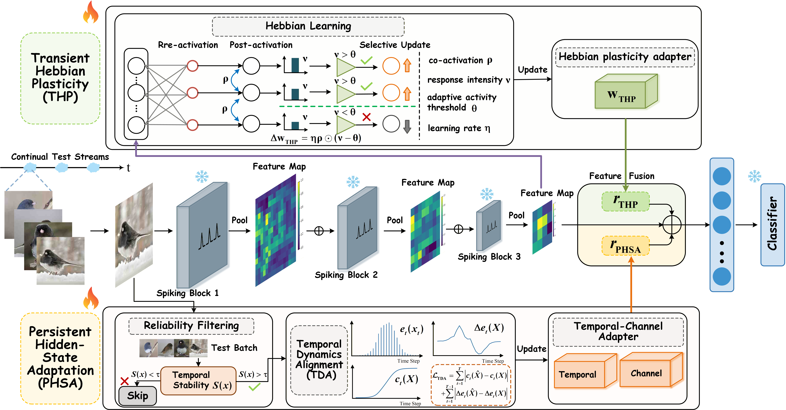

# Poise-and-React: Continual Test-Time Adaptation in Spiking Neural Networks

<p align="center">
  
</p>

## Overview

Spiking Neural Networks (SNNs) offer compelling advantages in energy efficiency and temporal information processing, yet remain particularly vulnerable to distribution shifts due to their temporal coding and sparse spike transmission mechanisms. While continual test-time adaptation (CTTA) provides a practical means of addressing evolving distribution shifts at inference, existing methods are designed for conventional artificial neural networks and rely on backpropagation-based parameter updates, introducing excessive overhead and accelerating error accumulation and source-domain forgetting when applied to SNNs. To address this, we propose Poise-and-React (PAR), the first CTTA method for SNNs, balancing rapid on-the-fly responsiveness with stable long-horizon refinement. PAR combines two complementary mechanisms: Transient Hebbian Plasticity (THP) for immediate backpropagation-free adaptation and Persistent Hidden-State Adaptation (PHSA) for stable hidden-state refinement with temporal alignment and reliability-aware filtering. This design enables efficient adaptation to evolving shifts with minimal overhead. PAR achieves state-of-the-art performance across multiple distribution-shift benchmarks on SNNs with CNN, Transformer, and ConvLSTM architectures, while requiring 100$\times$ fewer trainable parameters and over 30$\times$ lower runtime.

---

> 🔥 Tunable modules: THP + PHSA
> ❄️ Frozen modules: backbone

---

## Getting Started

### Requirements

We recommend the following environment (you may adjust based on your setup):

- python >= 3.8
- torch >= 1.13
- torchvision >= 0.14
- torchaudio >= 0.13
- timm
- numpy, tqdm, scikit-learn

Install dependencies:

```bash
pip install -r requirements.txt
```

### Prepare Data

We follow the multi-modal corruption protocol used in prior MM-TTA works (15 video corruptions × 6 audio corruptions = 90 combinations).

Step 1: Generate corrupted video/audio data
```bash
# Video corruptions
python data_process/make_c_video.py --corruption gaussian_noise --severity 5 --data-path /path/to/video_val
```

```bash
# Audio corruptions
python data_process/make_c_audio.py --corruption crowd --severity 5 --data-path /path/to/audio_val
```

Step 2: Create JSON files for evaluation
```bash
python data_process/create_video_audio_json.py --video_c_type gaussian_noise --audio_c_type crowd --severity 5 --json_root ./json_csv_files/ks50
```
### Note: 
 · Remember to change the --clean-path --video-c-path --audio-c-path to adapt your own case. \
 · You can download the original data from [here](https://drive.google.com/drive/folders/1SWkNwTqI08xbNJgz-YU2TwWHPn5Q4z5b). \
 · For more details on data preparation, please refer to [READ](https://github.com/XLearning-SCU/2024-ICLR-READ). 

### Prepare Pre-trained Models

The pre-trained models are provided by [READ](https://github.com/XLearning-SCU/2024-ICLR-READ). The pre-trained model for KS50 and VGGSound are [ks50](https://drive.google.com/file/d/1m38uCAfwL--RP6rWtOvGee4i2SfAzbjl/view) and [vgg_65.5](https://uc7264f246f3729c80858ed9e281.dl.dropboxusercontent.com/cd/0/get/C74gv1WsG61OcyRgamnuyrhEYMLXejmdUauksAeDiFfHXtbSPzSOWuyBDwZ3VHNWwsr0H81g52rFvryBDxr1Tj0YlvZvtKbRMhyB-s1fZr2DiYvVHl6t2VAtGgqR72oIsyIjOflJP-nOHk4D7bEe9jIr/file?dl=1#), respectively.

```bash
mkdir -p pretrained
# Put your checkpoint here:
# pretrained/cav_mae_ks50.pth
```

## Run Test-Time Adaptation
Example: Kinetics50-MC, both modalities corrupted
CUDA_VISIBLE_DEVICES=0 python run.py --dataset ks50 --tta-method OURS --pretrain_path ./pretrained/cav_mae_ks50.pth --corruption-modality both --audio_c_type crowd

## Acknowledgement
- PTA code is heavily used. [official](https://github.com/MPI-Lab/PTA)
- READ code is heavily used. [official](https://github.com/XLearning-SCU/2024-ICLR-READ)
